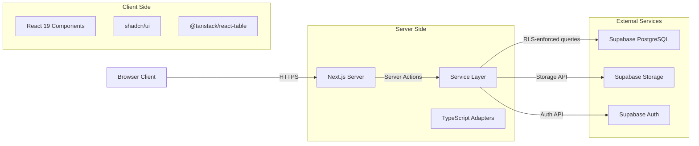
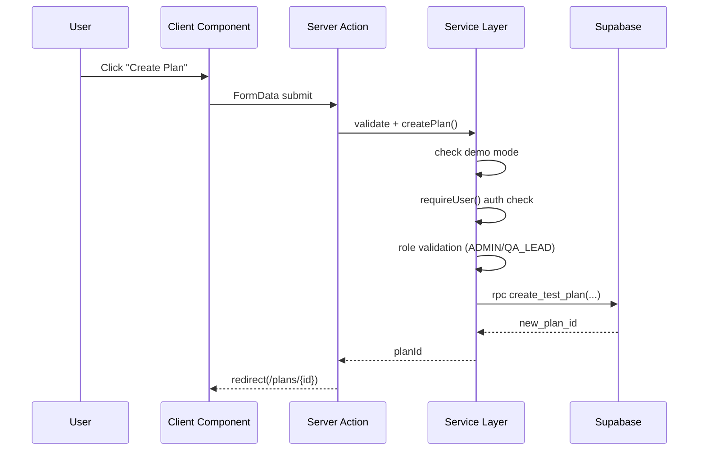
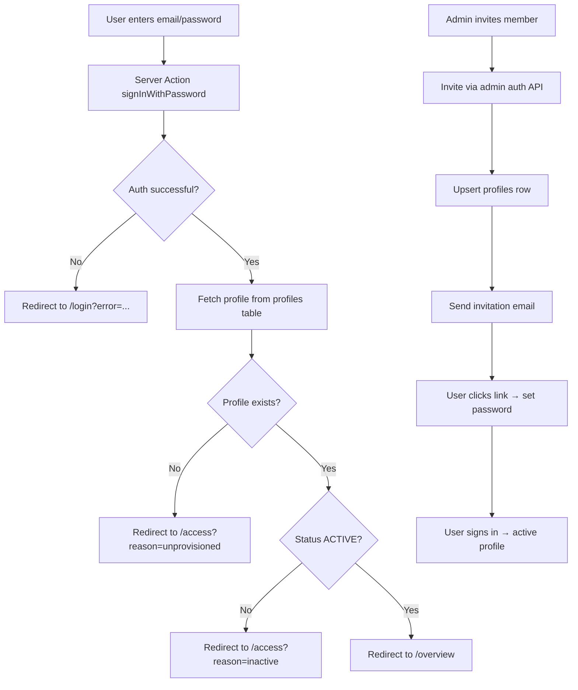
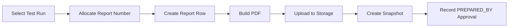

# Architecture

This document provides a deep technical overview of the CSSI QA Hub system architecture.

## System Boundaries



## Request/Data Flow

### Read Operations (Server Components)

1. Browser requests a page (e.g., `/overview`)
2. Next.js server component renders
3. Server calls `createClient()` from `@supabase/ssr` which reads cookies
4. Service function (e.g., `getOverviewData()`) executes the Supabase query
5. Data is passed as props to client components
6. Client components render with the data

### Mutation Operations (Server Actions)

1. User triggers an action (e.g., "Create Scenario")
2. Form submission calls a server action (`app/actions/scenarios.ts`)
3. Server action validates input with Zod
4. Server action calls service function (`services/scenarios.ts`)
5. Service function:
   - Checks `shouldUseDemoData()` for mock mode
   - Calls `createClient()` to get authenticated Supabase client
   - Validates role via `profiles` table or RLS
   - Executes mutation via RPC or direct query
   - Throws typed error (`ScenarioMutationError`)
6. Server action returns result or error to client

### Data Flow Diagram



## Authentication Flow



## Authorization Model

Three-layer defense:

### Layer 1: UI Authorization

- Navigation items conditionally rendered based on `profile.role`
- Action buttons disabled/hidden for unauthorized roles
- File: `lib/auth-access.ts`

### Layer 2: Server Authorization

- `requireUser()` ensures authenticated session
- Role checks in each service function
- Admin-only operations verified via `profiles.role = 'ADMIN'`
- File: `services/*.ts`

### Layer 3: Database RLS

- All tables have RLS enabled
- Security definer functions for role checks
- Row-level conditions in policies
- File: `supabase/migrations/*.sql`

## Server Actions

All mutations go through Next.js Server Actions in `app/actions/`:

| Action File      | Purpose                          |
| ---------------- | -------------------------------- |
| `auth.ts`        | Login, logout                    |
| `scenarios.ts`   | Create, update, delete scenarios |
| `plans.ts`       | Plan CRUD operations             |
| `runs.ts`        | Run management                   |
| `executions.ts`  | Execution status updates         |
| `findings.ts`    | Failures and feedback            |
| `board.ts`       | Board item moves                 |
| `reports.ts`     | Report generation and approvals  |
| `attachments.ts` | Evidence upload/delete           |
| `management.ts`  | Admin operations                 |

## Service Layer

The service layer (`services/`) is the core business logic. Key patterns:

### Error Handling

All services throw typed errors:

```typescript
export class ReportMutationError extends Error {
  constructor(
    message: string,
    readonly code:
      "FORBIDDEN" | "NOT_FOUND" | "VALIDATION" | "UNKNOWN" = "UNKNOWN"
  ) {
    super(message)
  }
}
```

### Demo Mode Gate

Every service function checks demo mode first:

```typescript
if (shouldUseDemoData()) return demoData
// ... real Supabase logic
```

### Adapter Pattern

Raw Supabase rows are mapped to typed interfaces:

```typescript
// services/reports.ts
const row = await supabase.from("reports").select(...)
const report = mapReportRow(row) // returns ReportListItem
```

## Supabase Interaction

### Client Types

1. **Server Client** (`lib/supabase/server.ts`)
   - Uses `createServerClient` from `@supabase/ssr`
   - Reads cookies from request context
   - Used for all authenticated queries

2. **Admin Client** (`lib/supabase/admin.ts`)
   - Uses service role key
   - Bypasses RLS (for invitation flow only)
   - Never exposed to browser

3. **Browser Client** (`lib/supabase/client.ts`)
   - Client-side only
   - Used in React components for direct Supabase access

### RPC Usage

Direct SQL functions are called via `supabase.rpc()`:

```typescript
const { data: number } = await supabase.rpc("next_report_number", {
  target_application_id: appId,
  target_year: 2026,
})
```

## RLS (Row Level Security)

All tables have RLS enabled. Key policy patterns:

### Read Policies

```sql
create policy scenarios_read on test_scenarios
  for select to authenticated using (true);
```

### Write Policies with Role Checks

```sql
create policy scenarios_insert on test_scenarios
  for insert to authenticated
  with check ((select private.has_role(array['ADMIN', 'QA_LEAD'])));
```

### Ownership Policies

```sql
create policy executions_update on test_executions
  for update to authenticated
  using ((select private.can_execute_run(test_run_id)))
  with check ((select private.can_execute_run(test_run_id)));
```

## Storage

### Bucket Configuration

Both buckets are private (`public = false`):

- `qa-evidence`: 50MB limit, evidence uploads
- `qa-reports`: 10MB limit, PDF storage

### Signed URLs

All file access uses signed URLs:

```typescript
const { data } = await supabase.storage
  .from("qa-evidence")
  .createSignedUrl(path, 3600) // 1 hour expiry
```

### Upload Flow

1. Client uploads to temporary path
2. Server validates path format (`executionId/filename.ext`)
3. Server inserts `attachments` row with metadata
4. If insert fails, cleanup uploaded file

## Report Generation

The report pipeline:



### PDF Generation

- Uses `lib/report-pdf.ts` to generate PDF bytes
- SHA-256 hash computed and stored in snapshot
- Immutable: snapshot cannot be modified

### Report Numbering

- Atomic increment via `next_report_number()` RPC
- Format: `QA-{APP_SLUG}-{YEAR}-{NUMBER:04d}`
- Per-application, per-year counter

## Demo Mode

Demo mode is controlled by environment variable:

```typescript
// lib/env.ts
export const env = {
  demoMode: process.env.NEXT_PUBLIC_QA_DEMO_MODE === "true",
}
```

When enabled:

- All `shouldUseDemoData()` checks return true
- Seed data from `lib/data/seed.ts` is returned
- Authentication is bypassed
- No Supabase calls are made

## Transaction Guarantees

### Atomic Report Creation

The `createAndFinalizeReport()` service function:

1. Allocates report number (atomic RPC)
2. Creates report row
3. Generates and uploads PDF
4. Creates snapshot row
5. Records approval

If any step fails, the transaction rolls back at the database level (Supabase supports transactions via `supabase.rpc()` with PL/pgSQL functions).

### Execution Recording

The `record_test_execution` RPC function:

1. Updates execution status
2. Inserts attempt row (immutable)
3. Updates execution steps
4. Returns success or error

All within a single database transaction.
